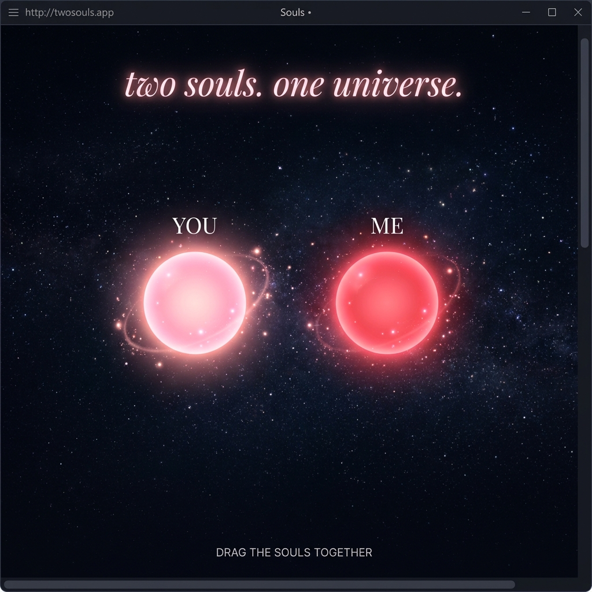
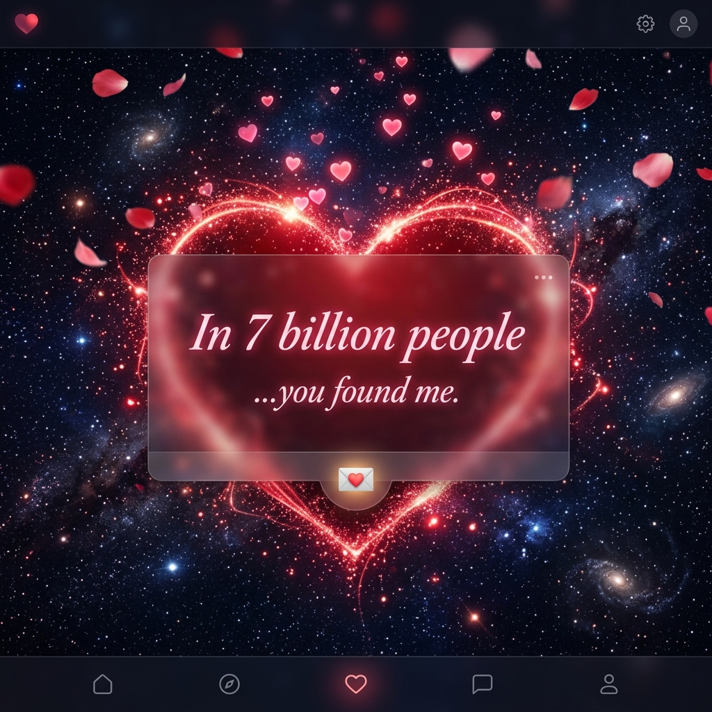
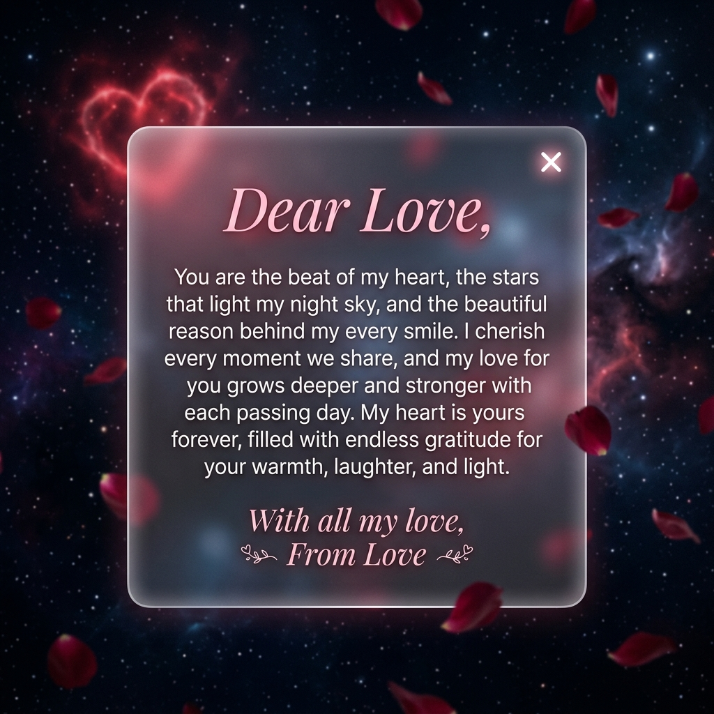

<div align="center">

# 💕 Find Me — In 7 Billion People

### *An Interactive Romantic Web Experience*

[](https://developer.mozilla.org/en-US/docs/Web/HTML)
[](https://developer.mozilla.org/en-US/docs/Web/CSS)
[](https://developer.mozilla.org/en-US/docs/Web/JavaScript)
[](https://developer.mozilla.org/en-US/docs/Web/API/Canvas_API)

*"Two souls. One universe."*

A beautifully crafted, interactive web experience that lets two glowing souls find each other across the cosmos. Drag them together and watch as they merge into a beating heart — surrounded by falling rose petals, floating mini-hearts, and a hidden love letter.

---

</div>

## ✨ Preview

<div align="center">

### 🌌 Two Souls Drifting in the Universe


### ❤️ The Moment They Find Each Other


### 💌 A Hidden Love Letter


</div>

---

## 🎮 How It Works

| Step | Action | Result |
|------|--------|--------|
| 1️⃣ | **Open the page** | Two glowing souls appear on a starry canvas — one labeled *YOU*, the other *ME* |
| 2️⃣ | **Drag a soul** | Click/tap and drag either soul toward the other |
| 3️⃣ | **Bring them close** | A glowing red thread appears, pulling them together |
| 4️⃣ | **Merge them** | 💥 An explosion of nebula clouds, shockwaves, and floating hearts |
| 5️⃣ | **Watch the heart form** | A large red heart draws itself and fills with a crimson glow |
| 6️⃣ | **Rose petals fall** | 🌹 Soft pink petals drift down from above |
| 7️⃣ | **Open the love letter** | 💌 Tap the glowing letter icon to reveal a glassmorphism love card |
| 8️⃣ | **Separate or replay** | Pull apart with two fingers (mobile) or right-click (desktop) to separate |

---

## 🌟 Features

### 🎨 Visual Effects
- **Particle Systems** — Hundreds of particles orbit each soul and form the heart shape
- **Starfield** — 160 twinkling stars with parallax movement
- **Nebula Burst** — Radial gradient explosions on merge
- **Shockwaves** — Expanding ring animations on soul connection
- **Floating Hearts** — Mini heart shapes that continuously rise from the merged point
- **Falling Rose Petals** — 🌹 Soft, rotating petals that gently fall across the screen

### 💖 The Heart
- **Parametric Drawing** — Heart shape drawn using the classic parametric heart equation
- **Progressive Reveal** — The heart traces itself stroke by stroke
- **Red Fill Animation** — Gradually fills with a pulsating crimson glow
- **Heartbeat Pulse** — The heart continuously beats with a realistic double-pulse rhythm

### 💌 Love Letter
- **Animated Entry** — The letter icon spawns from the merge point and floats to the bottom
- **Glassmorphism Card** — Frosted glass effect with blur, transparency, and soft white borders
- **Romantic Message** — A heartfelt letter addressed *"Dear Love"*
- **Tap to Open/Close** — Clean modal with smooth scale and fade transitions

### 📱 Mobile Optimized
- **Touch Dragging** — Full multi-touch support with finger offset for better visibility
- **Two-Finger Separation** — Pull souls apart with a pinch gesture
- **Performance Tuned** — Lightweight animations optimized for mobile GPUs
- **Responsive Layout** — Adapts beautifully to any screen size

### 🖥️ Desktop Support
- **Mouse Dragging** — Click and drag souls with the mouse
- **Right-Click Separation** — Right-click to pull merged souls apart
- **Hover Effects** — Souls shy away from your cursor when not being dragged
- **Device Orientation** — Stars shift with device tilt (on supported devices)

---

## 🛠️ Tech Stack

| Technology | Usage |
|-----------|-------|
| **HTML5 Canvas** | All particle systems, souls, heart drawing, stars, and effects |
| **Vanilla CSS** | UI overlays, glassmorphism, animations, and responsive layout |
| **Vanilla JavaScript** | Game loop, physics, touch/mouse handling, and state management |
| **Google Fonts** | *Cormorant Garamond* (serif) & *Inter* (sans-serif) |

> **Zero dependencies.** No frameworks, no build tools, no npm. Just pure HTML, CSS, and JavaScript.

---

## 🚀 Getting Started

### Quick Start

1. **Clone the repository**
   ```bash
   git clone https://github.com/yourusername/find-me-in-7-billion.git
   ```

2. **Open in browser**
   ```bash
   # Simply open index.html in any modern browser
   start index.html
   ```

That's it! No build step, no server required.

### Project Structure

```
Find Me — In 7 Billion People/
├── index.html          # Main HTML structure
├── styles.css          # All styling & animations
├── script.js           # Canvas rendering & interaction logic
├── screenshots/        # Preview images
│   ├── souls_apart.png
│   ├── souls_merged.png
│   └── love_letter.png
└── README.md           # This file
```

---

## 🎨 Color Palette

| Color | Hex | Usage |
|-------|-----|-------|
| 🔴 Deep Red | `#dc143c` | Heart fill |
| 💗 Hot Pink | `rgb(255,105,180)` | Soul A glow & particles |
| ❤️ Crimson | `rgb(255,60,60)` | Soul B glow & particles |
| 🌸 Rose | `#ff1493` | Floating hearts & petals |
| ⬛ Cosmic Black | `#00000f` | Background |
| ⚪ Pure White | `#ffffff` | Star cores & soul centers |

---

## 📱 Browser Compatibility

| Browser | Support |
|---------|---------|
| Chrome / Edge | ✅ Full Support |
| Safari / iOS Safari | ✅ Full Support |
| Firefox | ✅ Full Support |
| Samsung Internet | ✅ Full Support |

---

## 📄 License

This project is open source and available under the [MIT License](LICENSE).

---

<div align="center">

### Made with ❤️ for that one special person

*"Some things are written in the stars."*

</div>
